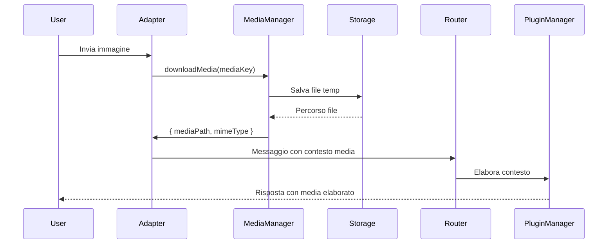

# Gestione Media

## Tipi di Media Supportati
| Tipo       | Telegram | WhatsApp | Note                          |
|------------|----------|----------|-------------------------------|
| Immagini   | ✅       | ✅       | Compressione automatica       |
| Documenti  | ✅       | ✅       | Limite 100MB                  |
| Audio      | ✅       | ✅       | Conversione in formato comune |
| Video      | ✅       | ✅       | Max 2GB                       |
| Sticker    | ✅       | ⚠️       | Conversione in immagini       |

## Flusso Elaborazione Media


## Configurazione Storage Media
In `.env`:
```ini
MEDIA_STORAGE_PATH=/var/userbot/media
MEDIA_MAX_SIZE=50  # MB
MEDIA_RETENTION_DAYS=7
```

## Personalizzazione Elaborazione
Per modificare il comportamento di default:
1. Estendi `MediaManager`:
```ts
class CustomMediaManager extends MediaManager {
  async processImage(buffer: Buffer): Promise<Buffer> {
    // Aggiungi watermark
    return await addWatermark(buffer);
  }
}
```
2. Fornisci la tua implementazione in `src/index.ts`:
```ts
const mediaManager = new CustomMediaManager({
  storagePath: process.env.MEDIA_STORAGE_PATH,
  maxSize: parseInt(process.env.MEDIA_MAX_SIZE || '50')
});
```

## Limitazioni Importanti
- I media vengono salvati temporaneamente e cancellati dopo `MEDIA_RETENTION_DAYS`
- I file superiori a 100MB vengono rifiutati con messaggio di errore
- Gli sticker di Telegram vengono convertiti in PNG
- I messaggi vocali vengono convertiti in MP3 per cross-platform compatibility
